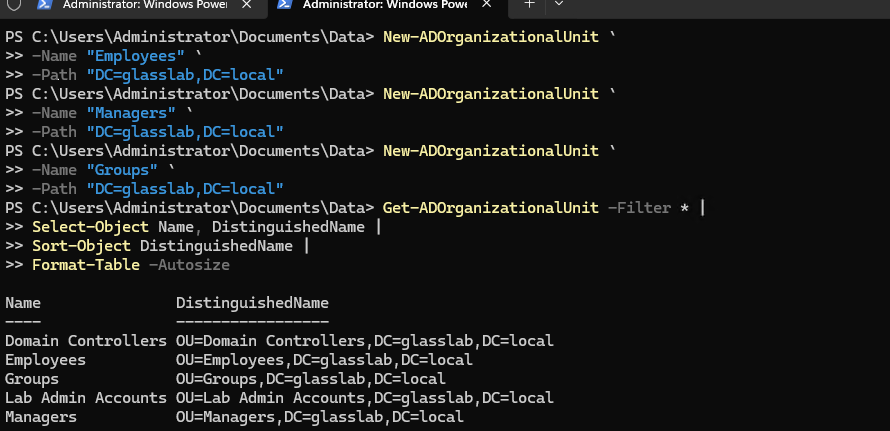
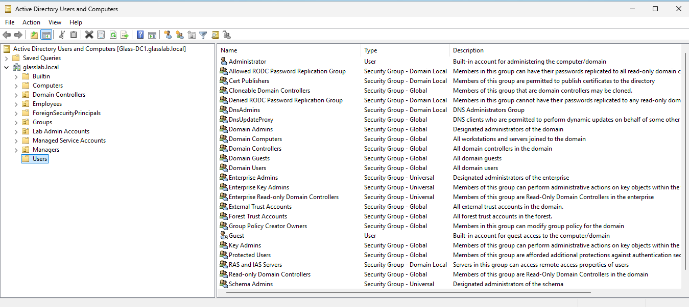

# Active Directory Domain Build

A Windows Server 2025 Active Directory lab built to practice domain administration, DNS, organizational structure, user and group management, PowerShell automation, and foundational Windows Server administration.

## Lab Environment

| Component          | Configuration                            |
| ------------------ | ---------------------------------------- |
| Domain Controller  | Glass-DC1                                |
| Operating System   | Windows Server 2025                      |
| Directory Services | Active Directory Domain Services (AD DS) |
| DNS                | Windows DNS Server                       |
| Management         | PowerShell / Server Manager              |
| Environment        | Hyper-V Homelab                          |

---

## Domain Controller

**Server Name:** `Glass-DC1`

**Operating System:** Windows Server 2025

**Primary Roles:**

* Active Directory Domain Services (AD DS)
* Domain Name System (DNS)

Glass-DC1 functions as the primary domain controller and DNS server for the homelab Active Directory environment.

---

## Initial Configuration

The domain controller was built and configured through the following process:

1. Installed Windows Server 2025
2. Configured a static IP address
3. Renamed the server to `Glass-DC1`
4. Installed the DNS Server role
5. Installed Active Directory Domain Services
6. Promoted the server to a Domain Controller
7. Configured the Active Directory domain
8. Created the initial Organizational Unit structure
9. Created users and security groups using PowerShell
10. Validated core domain services

---


### Organizational Unit Creation Through PowerShell

The following Organizational Units were created in PowerShell to separate users, computers, servers, administrative accounts, groups, and service accounts.



```text
Domain
│
├── Employees
├── Computers
├── Servers
├── Lab Admin Accounts
├── Groups
```



## Validation

The domain controller was validated by checking:

* Static IP configuration
* DNS configuration
* Active Directory Domain Services
* DNS Server service
* Netlogon service
* Active Directory Web Services
* Active Directory users and groups
* Organizational Unit structure

Core services were confirmed to be running, and the domain controller was successfully functioning as the central identity and DNS server for the lab environment.

---

## Skills Demonstrated

### Windows Server

* Windows Server 2025 installation
* Server configuration
* Active Directory Domain Services
* DNS
* Domain Controller deployment

### Active Directory

* Domain administration
* Organizational Units
* User accounts
* Security groups
* Administrative accounts
* Service accounts
* Group-based management

### PowerShell

* Active Directory administration
* User provisioning
* Group provisioning
* Administrative automation
* Object-based Windows administration

### Networking

* Static IP configuration
* DNS configuration
* Domain name resolution
* Understanding of domain controller network dependencies

---

## Next Steps

Planned expansion of the lab includes:

* Group Policy Objects (GPOs)
* Domain-joined client systems
* Additional Windows Server systems
* PowerShell automation
* Active Directory troubleshooting
* DNS troubleshooting
* Administrative delegation
* Security hardening
* Azure / Entra ID integration concepts

---

## Project Goal

The goal of this lab is to develop practical Windows Server and Active Directory administration skills through hands-on infrastructure deployment, PowerShell automation, troubleshooting, and documentation.

The environment will eventually serve as a foundation for exploring Azure administration, Infrastructure as Code (IaC), and cloud automation.
