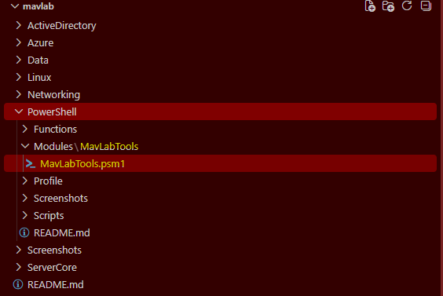
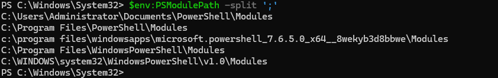
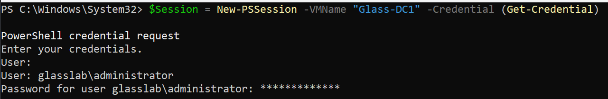
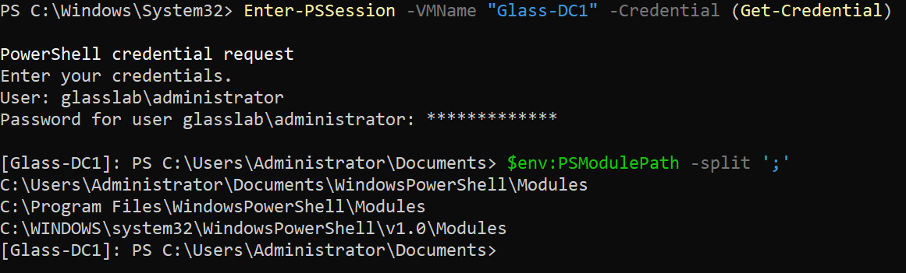
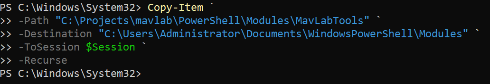
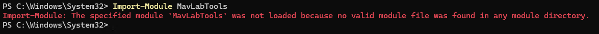
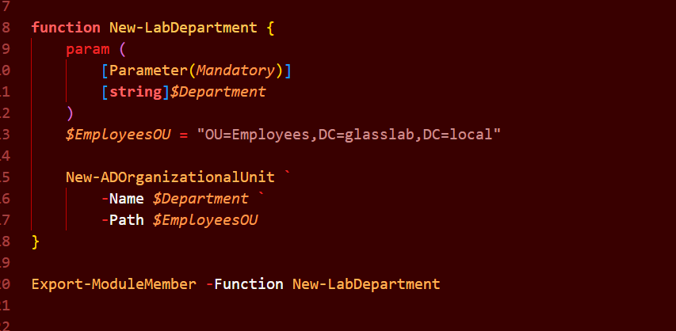

# PowerShell Automation Lab

## Project Overview

This lab focuses on building reusable PowerShell automation tools, deploying them to a Windows Server domain controller, and using PowerShell remoting to execute administrative tasks remotely.

The goal was to move beyond writing one-off PowerShell commands and begin developing a small, reusable administration toolkit that can be maintained locally, deployed to a server, and used to automate Active Directory tasks.

---

## Lab Goals

The primary goals of this lab were to:

* Build a reusable PowerShell module for common administrative tasks.
* Organize the module as a reusable toolkit rather than a collection of individual scripts.
* Create and manage PowerShell remoting sessions to a Windows Server domain controller.
* Deploy the PowerShell toolkit from the local development environment to DC1.
* Import and verify the module on DC1.
* Create PowerShell functions that interact with Active Directory.
* Practice reading information from Active Directory through custom functions.
* Practice making changes to Active Directory through custom functions.
* Improve the reliability of automation by adding logic that checks the current state before making changes.
* Document the development and deployment process with screenshots.

---

# Environment

### Local Development Machine

The PowerShell toolkit was developed locally and maintained in the lab Git repository.

```text
C:\Projects\mavlab\PowerShell\Modules\MavLabTools
```


### Domain Controller

The toolkit was deployed to:

```text
DC1
```

The module was installed under the Windows PowerShell module path:

```text
C:\Users\Administrator\Documents\WindowsPowerShell\Modules\MavLabTools
```

---

# Toolkit Creation

The first stage of the lab was creating the `MavLabTools` PowerShell module.

The module uses a `.psm1` file to contain reusable PowerShell functions.

Current module structure:

```text
MavLabTools
└── MavLabTools.psm1
```

The module currently contains functions for:

```text
Get-LabUsers
New-LabDepartment
```

The module exports the functions through:

```powershell
Export-ModuleMember -Function New-LabDepartment
```

The toolkit is maintained locally so that changes can be made, tested, and redeployed to the lab environment.

### Documentation

Screenshots document the creation of the toolkit and the module structure, including verifying that the module's directory was discoverable on the local `$PSModulePath`.



---

# PowerShell Remoting

A persistent PowerShell remoting session was created to establish communication with `DC1`.



The session was created using:

```powershell
$Session = New-PSSession -VMName "DC1" -Credential (Get-Credential)
```

The session was verified with:

```powershell
$Session
```

The session provided a reusable connection that could be passed to commands such as:

```powershell
Invoke-Command -Session $Session
```

and:

```powershell
Copy-Item -ToSession $Session
```

---

# Deploying the Toolkit to DC1

The local `MavLabTools` module was copied to the domain controller using PowerShell remoting.

The deployment process used:

```powershell
Copy-Item `
    -Path "C:\Projects\mavlab\PowerShell\Modules\MavLabTools\MavLabTools.psm1" `
    -Destination "C:\Users\Administrator\Documents\WindowsPowerShell\Modules\MavLabTools" `
    -ToSession $Session `
    -Force
```

This demonstrated how PowerShell can be used to deploy reusable administrative tooling to a remote Windows Server.



Before importing, the module was confirmed to not yet be loaded on DC1:



The module was then loaded on DC1 with:

```powershell
Import-Module MavLabTools
```

Module discovery and exported functions were verified using:

```powershell
Get-Module -ListAvailable MavLabTools
```

and:

```powershell
Get-Command -Module MavLabTools
```

The deployed module successfully exposed:

```text
Get-LabUsers
New-LabDepartment
```

### Documentation

Screenshots document:

* The PowerShell session with DC1.
* The toolkit being copied to DC1.
* Verification of the deployed module.
* Module import.
* Verification of the exported functions.

---

# Active Directory Automation

## Get-LabUsers

`Get-LabUsers` was created to provide a simplified interface for retrieving Active Directory user information.

The function was executed remotely on DC1:

```powershell
Invoke-Command -Session $Session -ScriptBlock {
    Get-LabUsers
}
```

The function successfully returned Active Directory users, including:

* Administrator
* Guest
* krbtgt
* The lab administrator account

The output also demonstrated PowerShell remoting metadata such as:

```text
PSComputerName : DC1
RunspaceId
```

This confirmed that the function was executing remotely against the domain controller.

---

# New-LabDepartment

`New-LabDepartment` was created to automate the creation of department Organizational Units within the `Employees` OU.

The initial version accepted a mandatory department parameter:

```powershell
New-LabDepartment -Department "IT"
```

The function used:

```text
OU=Employees,DC=glasslab,DC=local
```

as the parent OU.

The resulting structure included:

```text
Employees
├── IT
├── HR
└── Finance
```



---

# Sharpening the New-LabDepartment Logic

The initial implementation would attempt to create the requested OU every time the function was executed.

The function was then improved to check whether the requested department already existed before attempting to create it.

The updated logic constructs the department's Distinguished Name:

```powershell
$DepartmentOU = "OU=$Department,$EmployeesOU"
```

It then checks Active Directory for the existing OU.

If the OU exists, the function reports that the department already exists.

If the OU does not exist, the function creates it.

The logic uses:

```powershell
try {
    Get-ADOrganizationalUnit -Identity $DepartmentOU -ErrorAction Stop
}
catch {
    New-ADOrganizationalUnit `
        -Name $Department `
        -Path $EmployeesOU
}
```

This introduced the concept of **idempotent automation**.

### Tested Behavior

Existing department:

```powershell
New-LabDepartment -Department "IT"
```

Result:

```text
Department 'IT' already exists.
```

New department:

```powershell
New-LabDepartment -Department "HR"
```

Result:

```text
Department 'HR' created successfully.
```

The same behavior was also tested with the `Finance` department.

Running the command again after creation correctly detected that the department already existed rather than attempting to create a duplicate.

---

# Key Concepts Practiced

This lab provided hands-on practice with:

### PowerShell

* Functions
* Parameters
* Variables
* String interpolation
* `try/catch`
* `-ErrorAction Stop`
* `Export-ModuleMember`
* `Get-Module`
* `Get-Command`
* `Copy-Item`
* `Invoke-Command`

### PowerShell Remoting

* `PSSession`
* `New-PSSession`
* `Enter-PSSession`
* `Invoke-Command`
* `Copy-Item -ToSession`
* Remote execution context
* `PSComputerName`
* `RunspaceId`

### PowerShell Modules

* `.psm1` files
* Module directory structure
* `$PSModulePath`
* Module discovery
* Module importing
* Exported functions
* Deploying modules to a remote server

### Active Directory

* Organizational Units
* Distinguished Names
* Parent/child OU structure
* `Get-ADOrganizationalUnit`
* `New-ADOrganizationalUnit`
* Active Directory user queries
* Remote Active Directory administration

### Infrastructure Automation

* Reusable administrative tooling
* Remote deployment
* State checking
* Idempotent operations
* Separating development from execution environments

---

# Lessons Learned

A major lesson from this lab was that deploying a PowerShell module involves more than simply copying a `.psm1` file to a server.

PowerShell must be able to discover the module through its module path, and the module must follow the expected directory structure:

```text
Modules
└── MavLabTools
    └── MavLabTools.psm1
```

The lab also demonstrated the difference between:

```powershell
Enter-PSSession
```

and:

```powershell
Invoke-Command -Session $Session
```

`Enter-PSSession` provides an interactive remote shell, while `Invoke-Command` allows commands or script blocks to be executed remotely while remaining at the local PowerShell prompt.

Another important lesson was the value of making administrative automation **idempotent**. Instead of simply attempting to make a change, the function checks the current state of Active Directory before acting.

---

# Current State

The PowerShell automation portion of the lab has successfully demonstrated:

```text
Local Development
       ↓
MavLabTools Module
       ↓
PowerShell Remoting
       ↓
Deploy to DC1
       ↓
Import Module
       ↓
Execute Custom Functions
       ↓
Active Directory
       ↓
Read + Modify Directory
       ↓
Verify Results
```

The toolkit is now ready to serve as a foundation for additional Active Directory automation.

---

# Future Improvements

Potential improvements to the toolkit include:

* Additional input validation.
* Better error handling and user-friendly error messages.
* Additional Active Directory functions.
* Functions for creating users and groups.
* Functions for retrieving department information.
* Logging and audit information.
* Improved output formatting.
* More robust parameter validation.
* Additional automated deployment methods.
* Integration with the broader lab's infrastructure-as-code workflow.

The immediate focus of the lab will now shift toward the **Active Directory lab**, while the PowerShell toolkit can continue to evolve alongside it.
