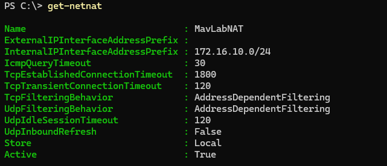

# MavLab

**Hands-on Infrastructure & Cloud Administration Lab**

MavLab is my personal infrastructure lab for building, breaking, troubleshooting, and documenting Windows, Linux, networking, and cloud environments.

I'm using the lab to move beyond simply knowing commands or following tutorials. I want to understand **what is happening underneath the GUI, why systems behave the way they do, and how the different pieces of an environment connect to each other.**

When something breaks, that's usually where the useful learning starts.

---

## Lab Philosophy

**Build → Break → Troubleshoot → Understand → Automate**

I use MavLab to practice the same process I'd use in a real infrastructure environment:

* Build and configure systems
* Test how they interact
* Break things intentionally or troubleshoot unexpected failures
* Isolate the problem
* Identify the root cause
* Document the resolution
* Automate repeatable tasks where it makes sense

The goal isn't just to make something work. **It's to understand why it works.**

---

## 🌟 Featured Project: Hyper-V NAT & Virtual Network Lab

The most in-depth writeup in this repo — a full build-and-troubleshoot case study covering Hyper-V virtual switching, Windows NAT, and a layered connectivity failure that took real diagnosis to untangle (ICMP failing while TCP/DNS still worked, a missing default gateway on the domain controller, and a DNS forwarder issue underneath it all).

* Built a custom Hyper-V virtual switch and NAT gateway from scratch to get an isolated `172.16.10.0/24` lab talking to the internet
* Diagnosed connectivity layer by layer — local gateway → internet → DNS — instead of assuming a single failed `ping` meant everything was broken
* Traced and fixed a DNS forwarder issue and a missing default gateway on the domain controller
* Documented every step with 13 screenshots and the full command history

**[→ Read the full writeup](./Networking/Hyper-V-NAT-Gateway/)**



---

## Current Environment

MavLab currently uses a virtualized infrastructure environment built with **Hyper-V**.

### Network

```text
Network: 172.16.10.0/24
```

| System | Role                               |     IP Address |
| ------ | ---------------------------------- | -------------: |
| DC1    | Windows Server / Domain Controller | `172.16.10.10` |
| SRV2   | Windows Server / Member Server     | `172.16.10.20` |
| Linux1 | Ubuntu Linux                       | `172.16.10.30` |

The environment is designed to give me a place to practice infrastructure administration across multiple systems rather than working with isolated machines.

---

# Infrastructure Areas

## Active Directory

Building and administering a Windows domain environment with:

* Active Directory Domain Services (AD DS)
* Domain Controllers
* Users and Groups
* Organizational Units
* Group Policy
* DNS
* Authentication and Authorization
* Forest Trusts
* Selective Authentication
* PowerShell administration

### Documentation

* [Active Directory Domain Build](./ActiveDirectory/domain-build.md)

---

## Networking

Practicing the fundamentals that connect the rest of the environment:

* TCP/IP
* IP addressing
* DNS
* DHCP
* Network connectivity
* Hyper-V virtual networking
* Network troubleshooting
* Windows networking tools

### Documentation

* [Hyper-V NAT Gateway](./Networking/Hyper-V-NAT-Gateway/) — featured project, see above
* [Network Build & Troubleshooting](./Networking/network-build.md)

---

## Windows Server

Building practical experience administering Windows Server across both GUI and command-line environments.

Areas include:

* Windows Server deployment
* Server Core
* PowerShell administration
* Active Directory
* DNS
* Group Policy
* Storage
* Remote administration
* Troubleshooting

### Documentation

* [Server Core Deployment](./ServerCore/srv2-deployment.md)

---

## Linux

Using Ubuntu alongside the Windows infrastructure to build familiarity with Linux administration and mixed operating system environments.

### Documentation

* [Linux Networking](./Linux/linux-networking.md)

---

# PowerShell & Automation

PowerShell is becoming a core part of how I administer the lab.

I'm using it to:

* Configure Windows Server
* Administer Active Directory
* Query system information
* Troubleshoot infrastructure
* Manage users and groups
* Automate repetitive tasks
* Reduce manual configuration

I'm intentionally learning PowerShell beyond individual commands by understanding **objects, properties, methods, parameters, pipelines, providers, and how PowerShell interacts with the systems underneath it.**

---

# Azure & Infrastructure as Code

I'm currently extending MavLab into Microsoft Azure.

My focus is on understanding how the infrastructure concepts I've learned on-prem translate into cloud environments.

Current areas of study:

* Microsoft Azure
* Microsoft Entra ID
* Azure RBAC
* Azure Virtual Networks
* Subnets
* Network Security Groups
* Azure Virtual Machines
* Azure Storage
* Azure CLI
* Azure PowerShell
* Bicep
* Infrastructure as Code

The goal is to move from manually configuring resources to **building repeatable infrastructure through code.**

Azure work will be added here as the lab develops.

---

# Troubleshooting

One of the main purposes of MavLab is troubleshooting.

Rather than documenting only successful configurations, I'm also documenting problems I encounter and how I work through them.

My troubleshooting process generally follows:

```text
Problem
   ↓
Observe
   ↓
Gather Evidence
   ↓
Form a Hypothesis
   ↓
Test
   ↓
Isolate the Fault
   ↓
Identify Root Cause
   ↓
Fix
   ↓
Verify
   ↓
Document
```

Future troubleshooting case studies will cover areas such as:

* Active Directory
* DNS
* Networking
* Windows Server
* PowerShell
* Virtualization
* Storage
* Azure

---

# Technology Stack

**Operating Systems**

* Windows 10/11
* Windows Server
* Ubuntu Linux

**Microsoft Infrastructure**

* Active Directory Domain Services
* DNS
* Group Policy
* Hyper-V
* Windows Server Failover Clustering
* iSCSI
* MPIO
* Data Deduplication

**Cloud**

* Microsoft Azure
* Microsoft Entra ID
* Azure RBAC
* Azure Virtual Networks
* Azure Virtual Machines
* Azure Storage

**Automation & Infrastructure as Code**

* PowerShell
* Azure CLI
* Bicep

**Tools**

* Git
* GitHub
* VS Code
* IntelliJ IDEA
* Jira

---

# What I'm Learning Next

MavLab is an evolving project.

My current focus is moving deeper into **Azure, PowerShell automation, and Infrastructure as Code**, while continuing to strengthen my Windows Server and networking fundamentals.

The long-term goal is to be able to:

**Build → Administer → Troubleshoot → Automate → Explain**

the infrastructure I'm responsible for.

---

## Why I'm Building This

I'm transitioning from a U.S. Army technical background into infrastructure and cloud administration.

I enjoy the part of technology where you have to dig.

Something doesn't work.

You don't immediately know why.

So you start pulling on the thread — checking the configuration, testing connectivity, looking at logs, questioning your assumptions, and figuring out how the pieces fit together.

That's what MavLab is for.

**Not just learning where the button is, but understanding what happens when you press it.**
